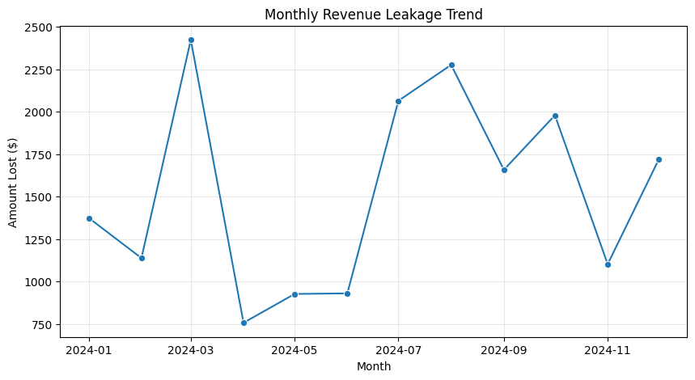
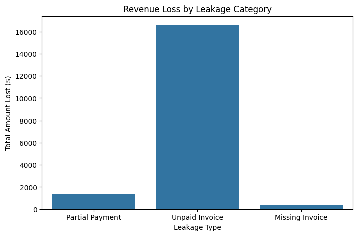
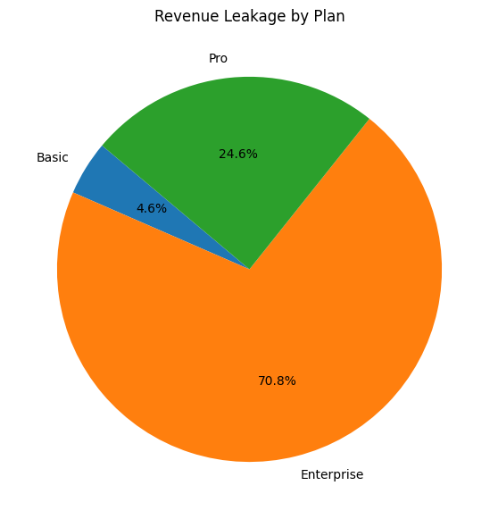

# 7: Final Visual Gallery

## 1. Leakage Trend (Volatility Analysis)
* **Insight:** The spike in March 2024 (visible in the line chart) correlates with the "Batch 03" update log, suggesting a regression introduced during that deployment.
* **Action:** Audit the code deployed on March 1st.

## 2. Leakage by Category (The Pareto Principle)
* **Insight:** The bar chart confirms that **Zombie Accounts** (Unpaid Invoices) dwarf all other error types.
* **Action:** Reallocate Engineering resources from "Ghost Hunting" to "Collections Automation."

## 3. Risk by Plan (Financial Impact)
* **Insight:** While "Basic" plans have a higher *count* of errors, the "Enterprise" bar is significantly higher in *dollar value*.
* **Action:** The Customer Success team must manually review the top 50 Enterprise Zombie accounts immediately.

## Conclusion
This visualization phase completes the feedback loop. We started with raw chaos, found the signal with SQL, and now have clear, visual evidence to present to stakeholders.