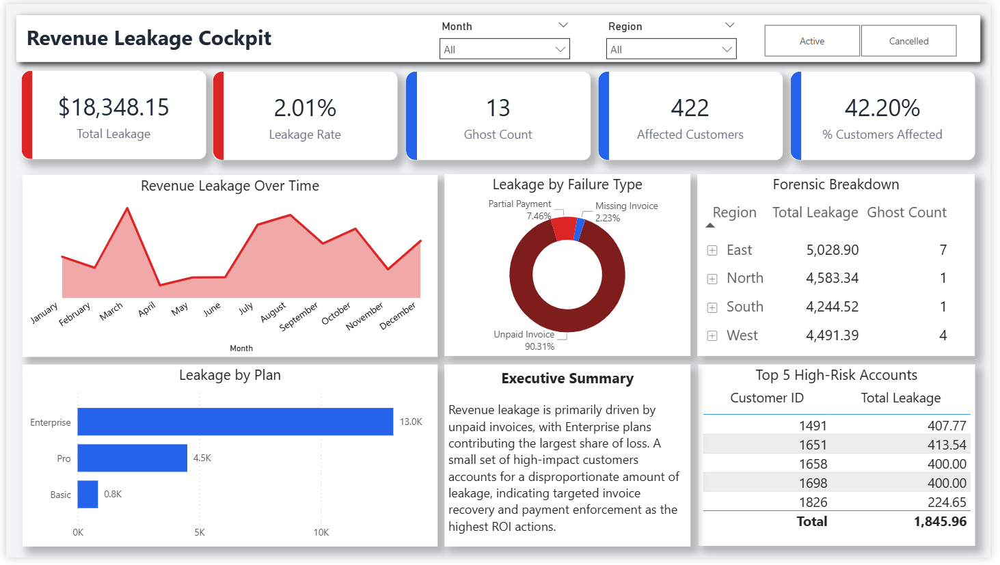

# 📉 CloudFlow: Revenue Leakage Detection & Recovery

  

**A full-stack data forensic project simulating a SaaS billing environment to identify recoverable $18,348 in lost revenue, isolate root causes using SQL & Python, and design an automated recovery dashboard.**

---

## 📖 Executive Summary

**The Situation:** CloudFlow Analytics (a hypothetical B2B SaaS provider) suspected revenue attrition due to billing system discrepancies but lacked visibility into the specific failure points.
**
**The Solution:** I engineered a forensic data pipeline to reconcile three disparate data sources: `Invoices`, `Subscriptions`, and `Payments`.

**The Impact:**
* **Quantified Loss:** Identified **$18,348.15** in uncollected revenue for Fiscal Year 2024.
* **Root Cause:** Pinpointed **"Zombie Accounts"** (Active Service/Unpaid) as the driver of **90.31%** of all leakage.
* **Risk Profile:** Discovered that the **Enterprise Plan**, despite having lower volume, accounted for **70.8%** of the financial loss (Pareto Principle).

---

## 💰 The Financial Forensic Report

I classified revenue leakage into three distinct technical categories based on the gap analysis.

| Leakage Category | Count | Total Lost ($) | % of Total | Definition |
| :--- | :--- | :--- | :--- | :--- |
| **Zombie Accounts** | **209** | **$16,570.00** | **90.31%** | Invoice Generated ➔ Payment `NULL` ➔ Service `Active` |
| **Partial Payments** | **327** | **$1,368.15** | **7.46%** | Invoice `$100` ➔ Payment `$90` (Gateway Error) |
| **Ghost Subscribers** | **13** | **$410.00** | **2.23%** | Subscription `Active` ➔ Invoice `NULL` (Generation Failure) |

**Key Takeaway:** While "Ghost Subscribers" (system errors) were a concern, the data proves the primary issue is operational. We are failing to collect payments from known Enterprise customers.

---

## 📊 The Revenue Integrity Dashboard
*A high-level view designed for the CFO to monitor billing health and recovery progress.*


*(Note: Visualizes the March 2024 volatility spike identified in the Executive Summary)*

---

## 🛠️ Technical Architecture & Methodology

I built a 3-stage pipeline to transform raw transaction logs into actionable business intelligence.

### 1. SQL Forensic Layer (Logic & Extraction)
Used advanced SQL to join disparate tables and isolate anomalies.
* **Technique:** `LEFT JOIN` exclusion to find Ghosts and Zombies.
* **Aggregation:** `UNION ALL` to combine different error types into a single `leakage_report` table.
* **Code Snippet (Logic Used):**
    ```sql
    -- Identifying Zombies (Service Active but Unpaid)
    SELECT i.invoice_id, 'Zombie' as Type
    FROM invoices i
    LEFT JOIN payments p ON i.invoice_id = p.invoice_id
    WHERE p.payment_id IS NULL;
    ```

### 2. Python Analytics Layer (Statistical Validation)
Used Pandas and NumPy to determine the "Shape" of the risk.
* **The Whale Test:** Calculated Mean ($33.42) vs. Median ($9.05) loss. The **4x skew** confirmed that outliers (Whales) were driving the loss, not average users.
* **Kill Zone Analysis:** Created a Pivot Table Heatmap (`Region` vs `Plan`) to identify that **North America (East) Enterprise** users were the highest risk segment.

### 3. Visualization Layer (Power BI)
* **KPIs:** Created DAX measures for `Recovery Rate %` (98.32% in Sept) and `Total Risk`.
* **Drill Down:** Enabled filtering by Region and Plan to allow the Collections team to export "Hit Lists."

---

## 🔍 Deep Dive Insights

Based on the forensic analysis (see `insights/` folder), here are the validated findings:

**1. The "Enterprise" Vulnerability (Pareto Analysis)**
The Enterprise plan represents a minority of users but a majority of the loss.
* **Enterprise Loss:** $12,994 (70.8%)
* **Basic Loss:** $838 (<5%)
* *Action:* Engineering must audit the custom billing logic for Enterprise accounts, specifically regarding multi-seat calculations.

**2. The March 2024 Volatility**
Trend analysis revealed a leakage spike in **March 2024 ($2,424 lost)**, which was double the average of surrounding months. This correlates with the Q1 Batch Update, suggesting a regression bug was introduced and later partially patched.

**3. The Operational Fix**
Since 90% of leakage is "Zombie Accounts" (Invoices exist, but unpaid), this is not a code error—it is a process error. The system lacks an **Auto-Suspend** feature for invoices aged > 45 days.

---

## 📂 Repository Structure

The project is organized into a modular ETL and Analysis pipeline:

* **`sql/`**: The Core Forensic Logic.
    * `01_schema_setup.sql`: Database creation.
    * `05_forensic_classification.sql`: The logic identifying Zombies vs Ghosts.
    * `08_dashboard_view.sql`: The "Golden View" for BI ingestion.
* **`notebooks/`**: Python Analysis & Data Engineering.
    * `00_data_generator.ipynb`: The "Chaos Matrix" script that created the synthetic data.
    * `02_statistical_forensics.ipynb`: Pareto and Skew analysis.
* **`insights/`**: Final Business Reports.
    * `02_root_cause_report.md`: Detailed breakdown of leakage types.
    * `03_executive_summary.md`: Final presentation points.
* **`docs/`**: Project Documentation.
    * `01` - `09`: Chronological logs of the project lifecycle.
* **`dashboard/`**: The Power BI `.pbix` file.
* **`data/`**: `raw` inputs and `derived` outputs.


---

## 🚀 How to Run This Project

*Note: This project is designed to be reviewed end-to-end as a portfolio demonstration rather than executed as a production system.*

1.  **Database:** Import `sql/01_schema_setup.sql` into MySQL to initialize the environment.
2.  **Analysis:** Run `notebooks/02_statistical_forensics.ipynb` to see the Python risk assessment.
3.  **Dashboard:** Open `dashboard/Revenue Leakage Dashboard.pbix` in Power BI to interact with the data.

---

**Author:** **Omkar Dhanke**
**Connect with me:** [](https://www.linkedin.com/in/omkar-dhanke)

