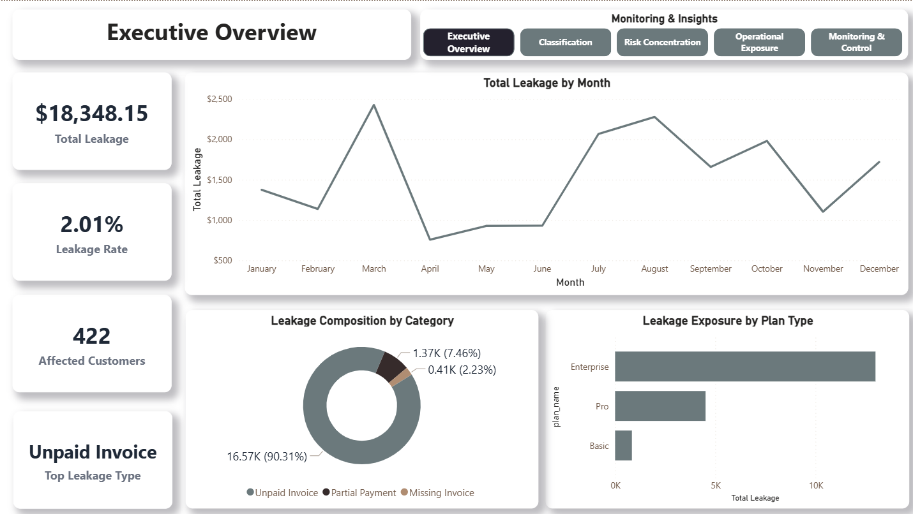
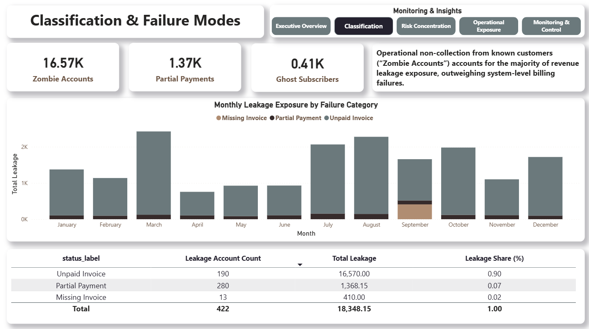
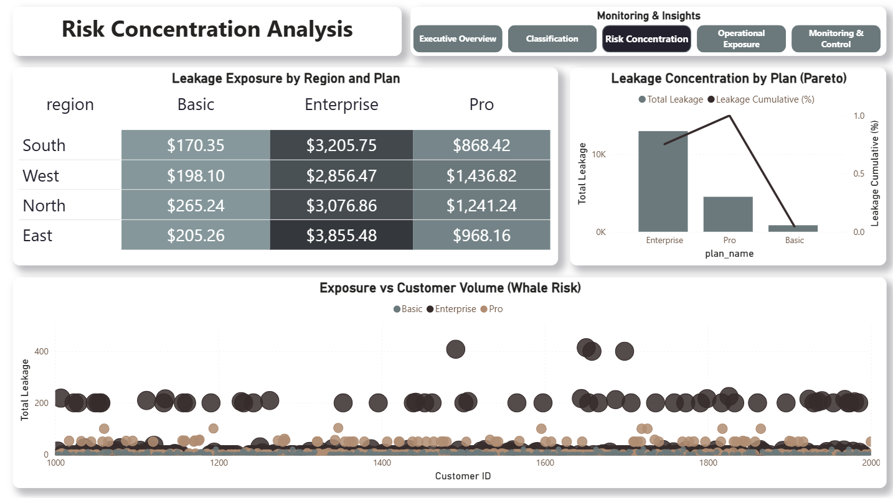
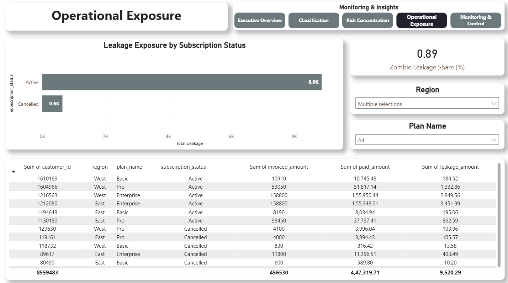
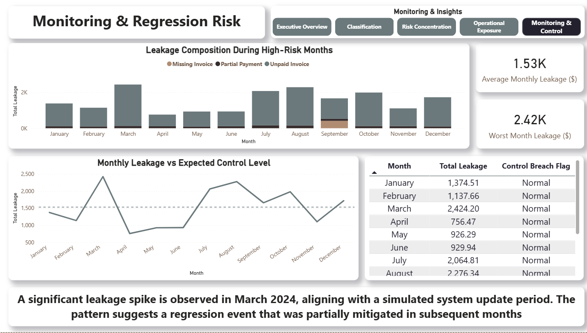

# 📉 CloudFlow
## Revenue Leakage Detection in a Simulated SaaS Billing System

  

**An end-to-end analytical audit simulation that models a SaaS subscription billing environment to detect, classify, and monitor revenue leakage exposure using SQL, Python, and Power BI. The project is designed to reflect how analytics teams support revenue integrity, operational prioritization, and monitoring in subscription-based businesses.**

---

>⚠️ **Important Note**
> - **All data used in this project is synthetically generated** to simulate realistic SaaS billing failure scenarios.
> - **Financial figures represent simulated revenue leakage exposure**, not actual revenue recovery.
> - This project focuses on revenue **analytics, reconciliation logic, and control validation,** not statutory or audited financial reporting.

---

## 📖 Executive Summary

### The Context

Subscription-based SaaS businesses frequently experience revenue leakage due to mismatches between subscriptions, invoices, and payments. These issues often remain undetected because failures are distributed across systems and masked by partial collections or delayed payments, making them difficult to identify without structured reconciliation and monitoring logic.

### The Objective

The goal of this project was to design and validate analytical controls capable of identifying where and why revenue leakage occurs within a billing system — not to recover real revenue, but to test detection logic against known failure patterns and assess exposure, concentration, and operational risk.

### The Outcome

The analysis surfaced **$18,348.15 in simulated revenue leakage exposure** for Fiscal Year 2024 and identified the dominant operational and system-level drivers of leakage. The project culminates in a **five-page executive monitoring dashboard** that supports investigation, prioritization, operational follow-up, and ongoing regression monitoring.

---

## 💰 Revenue Leakage Classification

Revenue leakage was classified into three deterministic categories based on reconciliation gaps between billing system components.

| Leakage Category | Count | Simulated Exposure ($) | % of Total | Definition |
|------------------|-------|------------------------|------------|------------|
| Zombie Accounts | 209 | 16,570.00 | 90.31% | Invoice exists → Payment missing → Service active |
| Partial Payments | 327 | 1,368.15 | 7.46% | Invoice amount ≠ Payment amount |
| Ghost Subscribers | 13 | 410.00 | 2.23% | Subscription active → Invoice missing |

### Key Insight
While system-level issues ("Ghost Subscribers") were present, the analysis shows that operational non-collection from known customers was the primary driver of revenue leakage exposure, highlighting a control gap rather than a data integrity failure.

---

## 📊 Revenue Integrity Dashboard

An executive-level, multi-page monitoring dashboard was designed to provide structured visibility into billing health, revenue leakage drivers, operational exposure, and regression risk.

The dashboard is organized into **five purpose-driven pages**, each answering a specific business question and supporting a distinct decision stage.

### 🔹 Page 1 — Executive Overview



**Purpose**  
This page provides a high-level assessment of overall revenue leakage exposure and trend behavior.

**What this page shows**
- Total simulated revenue leakage for FY 2024
- Overall leakage rate relative to invoiced revenue
- Number of affected customers
- Monthly leakage trend highlighting volatility
- High-level composition by leakage category and plan type

**How this page is used**  
This page is intended for executives and finance leadership to quickly determine:
- Whether revenue leakage is material
- Whether leakage levels are stable or volatile
- Whether deeper investigation is required

This page establishes scale and urgency, but does not explain root causes.

---

### 🔹 Page 2 — Classification & Failure Modes



**Purpose**  
This page explains why revenue leakage is occurring by classifying leakage into deterministic failure modes.

**What this page shows**
- Leakage exposure attributed to:
  - Unpaid Invoices (Zombie Accounts)
  - Partial Payments
  - Missing Invoices (Ghost Subscribers)
- Monthly leakage exposure broken down by failure category
- Account counts and exposure share by failure type

**How this page is used**  
This page helps distinguish between:
- Operational non-collection issues
- System-level billing failures

The dominance of Zombie Accounts indicates that leakage is primarily driven by process gaps, not missing system records.

---

### 🔹 Page 3 — Risk Concentration Analysis



**Purpose**  
This page identifies where revenue leakage risk is financially concentrated.

**What this page shows**
- Leakage exposure by Region × Plan combination
- Pareto analysis of leakage by plan type
- Exposure vs customer volume analysis to identify "whale risk"

**How this page is used**  
This page supports prioritization by revealing that:
- Enterprise plans contribute a disproportionate share of total leakage
- Leakage risk is concentrated among a smaller number of high-value customers

It enables targeted investigation instead of broad, unfocused remediation.

---

### 🔹 Page 4 — Operational Exposure



**Purpose**  
This page translates analytical findings into actionable operational insight.

**What this page shows**
- Leakage exposure by subscription status (Active vs Cancelled)
- Share of leakage driven by unpaid active subscriptions
- Customer-level table showing invoiced amount, paid amount, and leakage
- Filters for Region and Plan to support operational ownership

**How this page is used**  
This page is designed for billing and operations teams to:
- Identify active accounts leaking revenue
- Prioritize follow-up actions
- Validate the absence of automated suspension or escalation controls

This is the execution-focused page of the dashboard.

---

### 🔹 Page 5 — Monitoring & Regression Control



**Purpose**  
This page enables ongoing monitoring and early detection of abnormal leakage behavior.

**What this page shows**
- Monthly leakage compared against an expected control baseline
- Worst-month leakage for peak risk visibility
- Leakage composition during high-risk months
- Control status indicators to flag potential regression events

**How this page is used**  
This page supports governance and prevention by:
- Detecting leakage spikes following system updates
- Monitoring whether corrective actions reduce exposure over time
- Identifying regression risk before leakage compounds

This page transforms the dashboard from a one-time analysis into a continuous monitoring control.

---

### 🔁 Dashboard Usage Flow

The dashboard is designed to be used sequentially:

1. **Executive Overview** — Detect scale and volatility
2. **Classification** — Understand failure types
3. **Risk Concentration** — Prioritize high-impact segments
4. **Operational Exposure** — Act on current leakage
5. **Monitoring & Control** — Prevent recurrence

Each page builds on the previous one and serves a distinct analytical role.

---

## 🛠 Methodology & Technical Design

The project was designed as a multi-layer analytical control system, mirroring how revenue integrity and analytics teams validate billing accuracy, assess exposure, and monitor regression risk in subscription-based SaaS environments.

The architecture emphasizes:
- **Traceability** (clear linkage from raw transactions to leakage classification)
- **Interpretability** (logic that can be audited and explained)
- **Actionability** (outputs that support operational and executive decisions)

### 1️⃣ SQL Reconciliation Layer — Leakage Detection Logic

SQL serves as the foundation of the system, responsible for deterministic detection of billing inconsistencies across core SaaS entities: subscriptions, invoices, and payments.

Rather than relying on derived metrics alone, this layer explicitly reconciles transactional relationships to surface structural gaps.

**Key Design Principles**
- Every leakage type must be explainable by a missing or mismatched relationship
- Detection logic must be repeatable and auditable
- False positives are minimized through explicit status and aging conditions

**Core Techniques**
- LEFT JOIN exclusion logic to identify missing payments or invoices
- UNION ALL to consolidate distinct leakage patterns into a unified reporting view
- Invoice status and aging logic to distinguish delayed payments from true non-payment

```sql
SELECT 
    i.invoice_id,
    i.customer_id,
    i.invoice_amount,
    i.invoice_date
FROM invoices i
LEFT JOIN payments p 
    ON i.invoice_id = p.invoice_id
WHERE p.payment_id IS NULL
  AND i.invoice_status = 'Open';
```

In a production environment, this logic would be extended with:
- Aging thresholds
- Retry and grace-period logic
- Integration with suspension or escalation workflows

---

### 2️⃣ Python Analytics Layer — Risk Profiling & Concentration Analysis

Python is used to move beyond detection into risk understanding.

Once leakage is identified, this layer evaluates how exposure is distributed, helping distinguish widespread low-risk issues from concentrated, high-impact failures.

**Analytical Focus**
- Exposure concentration rather than raw counts
- Identification of high-value outliers ("whale risk")
- Segmentation of risk by Region and Plan

**Key Analyses**
- **Skew Analysis**: Mean vs median leakage comparison revealed strong right-skew, indicating that a small number of high-value accounts drive a disproportionate share of exposure
- **Segment Risk Mapping**: Region × Plan analysis surfaced Enterprise accounts as the dominant exposure segment across multiple regions

This layer ensures that remediation efforts are prioritized financially, not just operationally.

---

### 3️⃣ Visualization Layer (Power BI) — Monitoring & Decision Support

Power BI translates forensic and statistical findings into a five-page executive monitoring system, designed to support different decision levels across the organization.

Rather than a single summary view, the dashboard is structured to guide users through:
- Detection
- Diagnosis
- Prioritization
- Operational action
- Ongoing monitoring

**Design Focus**
- Clear separation of analytical intent across pages
- Minimal metric duplication
- Filters that support investigation without hiding risk

**Key Capabilities**
- Executive KPIs for scale and volatility assessment
- Classification views to isolate failure modes
- Risk concentration and Pareto analysis for prioritization
- Customer-level operational exposure views
- Time-series monitoring to detect regression events

Metrics are intentionally framed around visibility and control, not confirmed revenue recovery.

---

## 🔍 Deep Dive Insights

### 1️⃣ Enterprise Plan Vulnerability — Risk Concentration Effect

Enterprise plans represent a minority of customers but account for the majority of simulated revenue leakage exposure.

- **Enterprise Exposure**: $12,994 (70.8%)
- **Basic Exposure**: $838 (<5%)

**Interpretation**  
The disproportionate exposure suggests that custom billing logic, such as multi-seat pricing and plan-specific rules, introduces higher failure risk compared to standardized plans.

**Implication**  
High-value plans require stricter validation and monitoring, not looser controls.

---

### 2️⃣ March 2024 Volatility — Regression Risk Signal

Monthly trend analysis revealed a pronounced leakage spike in March 2024, approximately double the surrounding months.

- **Peak Exposure**: $2,424
- **Context**: Simulated Q1 system update

**Interpretation**  
The timing and persistence of elevated leakage suggest a regression event introduced during a system change and only partially mitigated afterward.

**Implication**  
Without post-deployment monitoring, billing regressions can remain undetected for extended periods.

---

### 3️⃣ Operational Process Gap — Auto-Suspend Failure

Over 90% of leakage exposure is driven by unpaid invoices linked to active subscriptions.

- **Zombie Account Share**: 90.31%

**Interpretation**  
This pattern indicates a process control failure, not a data or system integrity issue.

**Control Gap**  
No automated suspension or escalation for invoices aged beyond a defined threshold

**Recommendation**  
Implementing an automated suspension or escalation rule for invoices aged >45 days would mitigate the majority of forward-looking leakage risk.

---
* **Author:** **Omkar Dhanke**    
* **Connect with me:** [](https://www.linkedin.com/in/omkar-dhanke)


